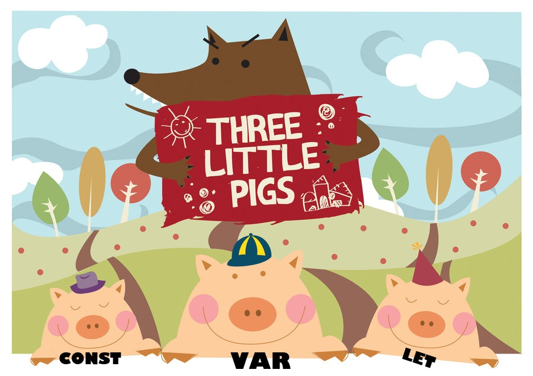
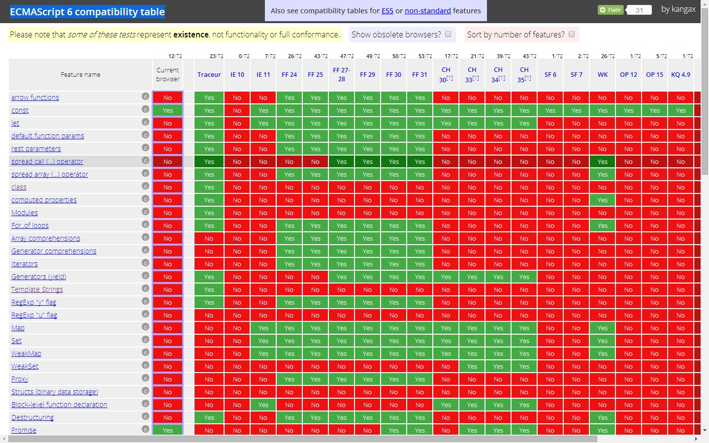
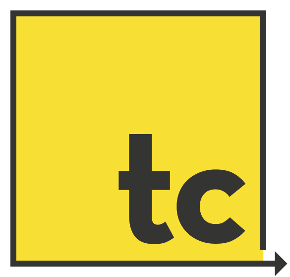

<!--

WARNING!! DON'T EDIT THE FILE README.md on the root of the project, that one is a GENERATED FILE!

You should just edit the source file at src/README.md - the one which stars with ## Ecmascript 6: Bring some harmony to your life

-->

## Ecmascript 6: Bring some harmony to your life


Flavio Coutinho @ [Avenue Code](http://www.avenuecode.com)

*fcoutinho@avenuecode.com*

Apr 29th, 2014

---

<!-- .slide: auto-fragments -->
## Agenda

- Brief history of javascript
- New features
  - Scope
  - Classes
  - Default parameters
  - ...
- Running ES6 today
- Conclusion
- Challenge

---

<!-- .slide: data-auto-fragments="true" -->
## Prerequisites
- Experience with real-life javascript
- Open mind

---

<!-- .slide: data-state="timeline" data-auto-fragments="true" -->
## The history of javascript

1. |1995| Brendan Eich created javascript for Netscape
1. |1996, August| Micro$oft created JSCript on IE and IIS 3.0
1. |1996, November| Netscape submitted it to Ecma International -> ECMAScript
1. |1997, June| ECMAScript 2
1. |1999, December| ECMAScript 3
1. |2009, December| ECMAScript 5 (?)
1. |2011, June| ECMAScript 5.1
1. |2014| ECMAScript 6

---

## New stuff coming in ES6

<div data-state="itemcloud">
- Block scope
- Classes
- Default function params
- Destructuring
- Rest and Spread operator
- Array comprehension
- FAT and thin arrows
- Maps and Sets
- Tail recursive calls
- Quasi-literals
- Generators
- Modules
- Promises
</div>

---

## Scope

<p class="full-height-container">
  
</p>

----

## *var*, <small>the older brother</small>

 - Declares variables in the function scope (ES5) <!-- .element: class="fragment" data-fragment-index="1" -->
 ```js
 var name = 'I am the elder pig';

 function whoAreYou() {
    window.alert('who are you: ' + name);
    var name = "don't know";
 }

 whoAreYou();
 ```
<!-- .element: class="fragment" data-fragment-index="1" -->

Quiz of the day: whoAreYou()? <!-- .element: class="fragment" data-fragment-index="2" -->

Answer: <!-- .element: class="fragment" data-fragment-index="3" --> *undefined* <!-- .element: class="fragment" data-fragment-index="3" --> <small>([on jsfiddle](http://jsfiddle.net/R2C2v/) for non-believers)</small> <!-- .element: class="fragment" data-fragment-index="3" -->

<span>Why? </span> <!-- .element: class="fragment" data-fragment-index="4" -->
<span>YUI? </span> <!-- .element: class="fragment" data-fragment-index="5" -->
<span>Because of *hoisting*!</span> <!-- .element: class="fragment" data-fragment-index="6" -->

----

## *let* and *const*, <small>the twins</small>

```js
const DAILY_PIG_FOOD = 800; // grams

function feedPigs(piggery) {
  for (let i = 0; i < piggery.length; i++) {
    piggery[i].feed(DAILY_PIG_FOOD);
  }

  console.log('i: ' + i);   // throws error: ReferenceError: i is not defined
  DAILY_PIG_FOOD = 400;     // executes ok
  console.log('DAILY_PIG_FOOD: ' + DAILY_PIG_FOOD); // prints 800
}
```

See more at: [An introduction to ES6 Part 2: Block Scoping](http://globaldev.co.uk/2013/09/es6-part-2/)

---

## Class <small>(ES5)</small>

```js
function Vehicle(brand, type) {
  this.brand = brand;
  this.type = type;
}

Vehicle.prototype.turnOn = function(options) {
  //...  
};

```

----

## Class <small>(*ES6*)</small>

```js
class Vehicle {
  constructor(brand, type) {
    this.brand = brand;
    this.type = type;
  }
  turnOn(options) {
    //...
  }
}

```

----

## Class Inheritance <small>(ES5)</small>

```js
function Car(brand, type, model) {
  Vehicle.call(this, brand, type);
  this.model = model;
}

Car.prototype = Object.create(Vehicle.prototype);
Car.prototype.turnOn = function(options) {
  Vehicle.prototype.turnOn.call(this, options);
  // do extra car stuff
}
```

----

## Class Inheritance <small>(*ES6*)</small>

```js
class Car extends Vehicle {
  turnOn(options) {
    super.turnOn(options);
  }
}
```

es6fiddle:

 - [Car and vehicle](http://www.es6fiddle.net/hukmpu6l/)
 - [Item Cloud RevealJS plugin](http://www.es6fiddle.net/hukn6opl/)

----

<!-- .slide: data-auto-fragments="true" -->
## Class: PROS and CONS

 <b>PROS:</b>

 - classes make it *easier for newcomers* to get started with JavaScript
 - have a *language supported inheritance mechanism*
 - very *clear and expressive syntax*


 <b>CONS:</b>

 - does not prevent it from being used *without new*
 - no privacy control from the language

---

## Default arguments

How we do it: <!-- .element: class="fragment" data-fragment-index="1" -->

```js
function tellHistory(lang, year) {
  return (lang || 'C') + ' was created around the year ' + (year || 1972);
}
```
<!-- .element: class="fragment" data-fragment-index="1" -->

In ES6: <!-- .element: class="fragment" data-fragment-index="2" -->

```js
function tellHistory(lang = 'C', year = 1972) {
  return lang + ' was created around the year ' + year;
}
```
<!-- .element: class="fragment" data-fragment-index="2" -->

---

## *Rest* and Spread <small>operators</small>

How can you create an html unordered list, given its text elements? <!-- .element: class="fragment" data-fragment-index="1" -->

```js
function createHTMLList() {
  var args = Array.prototype.slice.call(arguments),
  return '<li>' + args.join('</li><li>') + '</li>';
}
```
<!-- .element: class="fragment" data-fragment-index="1" -->

But on ES6, we can use the <!-- .element: class="fragment" data-fragment-index="2" --> *rest* <!-- .element: class="fragment" data-fragment-index="2" --> operator instead of <!-- .element: class="fragment" data-fragment-index="2" --> *arguments*: <!-- .element: class="fragment" data-fragment-index="2" -->
```js
function createHTMLList(...items) {
  return '<li>' + items.join('</li><li>') + '</li>';
}
```
<!-- .element: class="fragment" data-fragment-index="2" -->

----

## Rest and *Spread* <small>operators</small>

How can you instantiate a date from the values of 3 inputs (day, month, year)? <!-- .element: class="fragment" data-fragment-index="1" -->

```js
var day = getDateDay(),
    month = getDateMonth(),
    year = getDateYear();
var d = new Date(year, month, day);
```
<!-- .element: class="fragment" data-fragment-index="1" -->

But on ES6, we can leverage the <!-- .element: class="fragment" data-fragment-index="2" --> *spread* <!-- .element: class="fragment" data-fragment-index="2" --> operator: <!-- .element: class="fragment" data-fragment-index="2" -->

```js
var dateFields = getDateFieldsValues(),
    d = new Date(...dateFields);
```
<!-- .element: class="fragment" data-fragment-index="2" -->

----

## *Rest* and *Spread* <small>operators</small>

Bottomline:

 - the *rest* operator turns a parameter into an array of values
 - the *spread* operator turns an array of values into "comma-separated" values
   ```
   var pets = ['rat', 'dragon', 'bee'];

   console.log(pets);                      // prints: rat, dragon, bee
   console.log(...pets);                   // prints: rat dragon bee
   console.log(pets[0], pets[1], pets[2])  // prints: rat dragon bee
   ```
   Run on [es6fiddle](http://www.es6fiddle.net/huktq4ed/)
 - both have the same symbol: ...

---

## Destructuring

 - placeholder
 - placeholder
 - placeholder
 - placeholder


---

## <b>FAT</b> vs <span style="font-family: monospace;">thin</span> arrow

 - placeholder
 - placeholder
 - placeholder
 - placeholder


---

## String templates <small>(quasi-literals)</small>

Have you seen this? <!-- .element: class="fragment" data-fragment-index="1" -->

```js
var tone = Math.random() * 155 + 100;
var color = 'rgb('+ tone  +', ' + tone + ', ' + tone + ')';
```
<!-- .element: class="fragment" data-fragment-index="1" -->

There is a better way:<!-- .element: class="fragment" data-fragment-index="2" -->

```js
var tone = Math.random() * 155 + 100;
var color = `rgb(${tone}, ${tone}, ${tone})`;
```
<!-- .element: class="fragment" data-fragment-index="2" -->

What about this? <!-- .element: class="fragment" data-fragment-index="3" -->

```js
console.log('Cart total: R$ ' + (quantity * unitPrice) + ',00');
```
<!-- .element: class="fragment" data-fragment-index="3" -->

Becomes: <!-- .element: class="fragment" data-fragment-index="4" -->

```js
console.log(`Cart total: R\$ ${quantity * unitPrice},00`);
```
<!-- .element: class="fragment" data-fragment-index="4" -->

----

## String templates

General form: <!-- .element: class="fragment" data-fragment-index="1" -->

```js
tag`literal${substitution}literal`
```
<!-- .element: class="fragment" data-fragment-index="1" -->

In which the tag is a function that can post-process the template after the substitution happens. <!-- .element: class="fragment" data-fragment-index="2" -->

See more here: [A critical review of ES6 quasi-literals](http://www.nczonline.net/blog/2012/08/01/a-critical-review-of-ecmascript-6-quasi-literals/#content) <!-- .element: class="fragment" data-fragment-index="2" -->

----

## String templates: Pros and Cons

 <b>PROS</b>

 - more elegant, less verbose string creation
 - multiline strings
 - allows the creation of DSLs

 <b>CONS</b>

 - substitution variables must be in the same scope
 ```js
 var msg = `Hello, ${place}`;    // throws error
 ```
 - cannot externalize strings


---

## Running ES6 today

 - As of today, there is no browser that supports all of the ES6 features.

 - This curated table shows the current compatibility table for each feature:



See it on [ECMAScript 6 compatibility table](http://kangax.github.io/es5-compat-table/es6/)

----

## Running ES6 today

 - This presentation was partially built on ES6
   You can check its source code on the [Github repository](https://github.com/fegemo/talk-es6)
 - I used [google-traceur](https://github.com/google/traceur-compiler): an ES6 to ES5 transpiler



 - Here is the [list of features](https://github.com/google/traceur-compiler/wiki/LanguageFeatures) supported by traceur

---

## Features not covered

### Big stuff

 - Promises
 - Modules
 - Maps and Sets
 - Generators
 - Annotations

----

## Features not covered

### Not that big

 - Computed Property Names
 - Iterators and for-of
 - Object Initializer Shorthand
 - Symbols
 - Array Comprehension

---

## Conclusion

- ECMAScript 6 brings features to the language that had been developed outside it
- There is no 100%-ready environment that supports the full ES6 yet
- We can use some features of ES6 today
- More juice will come on ES7 (e.g., privacy in classes)

---

## Learn more

1. [Understanding ECMAScript 6](https://leanpub.com/understandinges6/read)
1. [Use ECMAScript 6 Today, at tutsplus.com](http://code.tutsplus.com/articles/use-ecmascript-6-today--net-31582)
1. [Examples of use of let, const and optional params](http://peter.michaux.ca/articles/javascript-is-dead-long-live-javascript)
1. [ECMAScript 6 compatibility table](http://kangax.github.io/es5-compat-table/es6/)
1. [ES6 Classes](http://www.2ality.com/2012/07/esnext-classes.html)
1. [ES6 Modules](http://www.infoq.com/news/2013/08/es6-modules)
1. [ES6 Fiddle](http://www.es6fiddle.net/)
1. [A Critical Review of quasi-literals](http://www.nczonline.net/blog/2012/08/01/a-critical-review-of-ecmascript-6-quasi-literals/)

---

## Challenge

 - placeholder